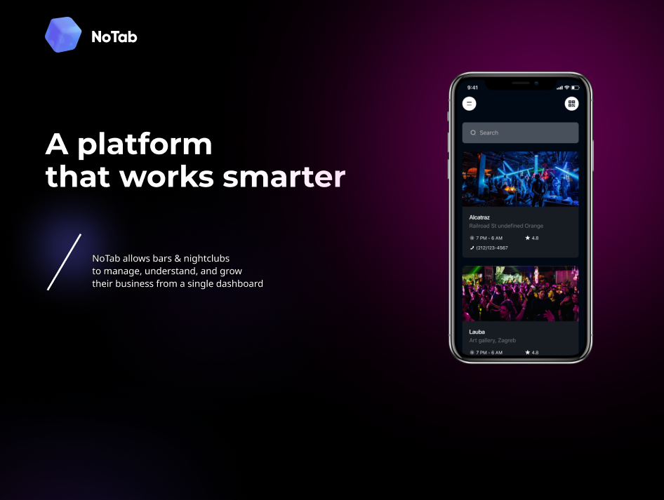

# Верстка сайта по макету Figma



## Срок сдачи работ

Последний коммит и пул реквест должен быть оформлен до 15.06

## Цель:

Используя только CSS, оформить готовую HTML-страницу так, чтобы все элементы корректно располагались согласно макету Figma

[Дизайн Figma](https://www.figma.com/design/LBLXsEwRsK4ZThrYLmxMN3/%D0%A0%D0%B0%D0%B7%D1%80%D0%B0%D0%B1%D0%BE%D1%82%D0%BA%D0%B0-%D0%B8%D0%BD%D1%82%D0%B5%D1%80%D1%84%D0%B5%D0%B9%D1%81%D0%BE%D0%B2?m=auto&t=6nboKSP8Dl00SreU-1)

## Советы

### Резет CSS

Подключите [данный](https://gist.githubusercontent.com/ktkv419/c8840dfcbcff24248c20f4199108b28e/raw/eec499022cca5ed984d91d2a2c2736d2aef8ed6d/reset.css) CSS файл перед подключением вашего для нормализации правил CSS


### Контейнеры

У вас в Фигме предоставленно 2 экрана на 2 вьюпорта (1440px и 375px), соответственно вы верстаете согласно макетам **контейнер**, то что находится за его границами - пустота и остатки картинок и градиентов (остатки вьюпорта). Не нужно пытаться растянуть 1440px на 1920px. Также не надо оптимизировать верстку ниже указанной ширины в Фигме (работа будет проверяться на диапазоне от FHD до 375px)

### Шрифты

Все шрифты есть на Google Fonts:

- Montserrat
- Noto Sans
- Inter

### Градиенты

#### Подход 1

Создать `div`, задать ему размеры и сделать переход от цвета до прозрачного через `radial-gradient` для свойства `background`

```CSS
background: radial-gradient(ellipse, #3333ff, #3333ff00);
```

#3333ff**00** - прозрачный цвет

#3333ff**ff** - видимый цвет

#### Подход 2

Создать `div`, задать ему размеры и `border-radius: calc(infinity * 1px)` (_На самом деле подойдет любое значение 50%+, тут просто точно будет круг/овал_), наложить `blur` эффект через свойство `filter` и прозрачность через `opacity`

```CSS
.blurred-circle {
    background: #3333ff;
    border-radius: calc(infinity * 1px);
    opacity: 0.5;
    filter: blur(100px);
}
```

_Этот подход предпочтительнее_

### Виньетка на картинке

Делается отдельным дивом **поверх** картинки, например

```html
<div class="vignette-container">
    
    <div class="vignette-overlay"></div>
</div>

<style>
    .vignette-container {
        position: relative;
        width: 800px;
        height: 500px;
        overflow: hidden;
    }

    .vignette-container img {
        width: 100%;
        height: 100%;
        object-fit: cover;
    }

    .vignette-overlay {
        position: absolute;
        top: 0;
        left: 0;
        width: 100%;
        height: 100%;
        pointer-events: none;
        background: linear-gradient(
            to bottom,
            rgba(0, 0, 0, 0.5),
            transparent 30%,
            transparent 70%,
            rgba(0, 0, 0, 0.5)
        );
    }
</style>
```

### Экраны телефона

Экспортируйте группы как `png` в `x1.5`

### Единицы измерения

> [!WARNING]
> За пиксели будут сниматься баллы

Используйте REM'ы и вьюпорт размеры. Либо через хак, описанный в lab13, либо через переменные (как указано в статье в lab13), либо статичными значениями

_Единственное место, где адекватно использовать пиксели - бордеры, блюр (и некоторые другие случаи, где относительные единицы измерения дают неожиданный результат), `@media` и случаи, которые описаны в lab13_

### Картинки

Создайте в корне проекта папку `public` и в неё складывайте все медиа

### Favicon

__Фавикон__ — это маленькая иконка, которая отображается на вкладке браузера рядом с названием сайта

Над десктопным макетом есть логотип в размере 32x32 пикселя. Экспортируйте его в масштабе 1x, добавьте в папку с медиа и подключите его в теге `head`

```html
<link rel="icon" href="favicon.png" type="image/png" />
```

## Как сдавать

1. Создайте форк репозитория в организации `21ISR` с названием `uidev-lab14-вашафамилия`
2. Используя ветку `wip` сделайте задание
3. Зафиксируйте изменения в вашем репозитории
4. Когда документ будет готов - создайте пул реквест из ветки `wip` (вашей) на ветку `main` (тоже вашу) и укажите меня ([ktkv419](https://github.com/ktkv419)) как reviewer

**Не мержите сами коммит**, это сделаю я после проверки задания
